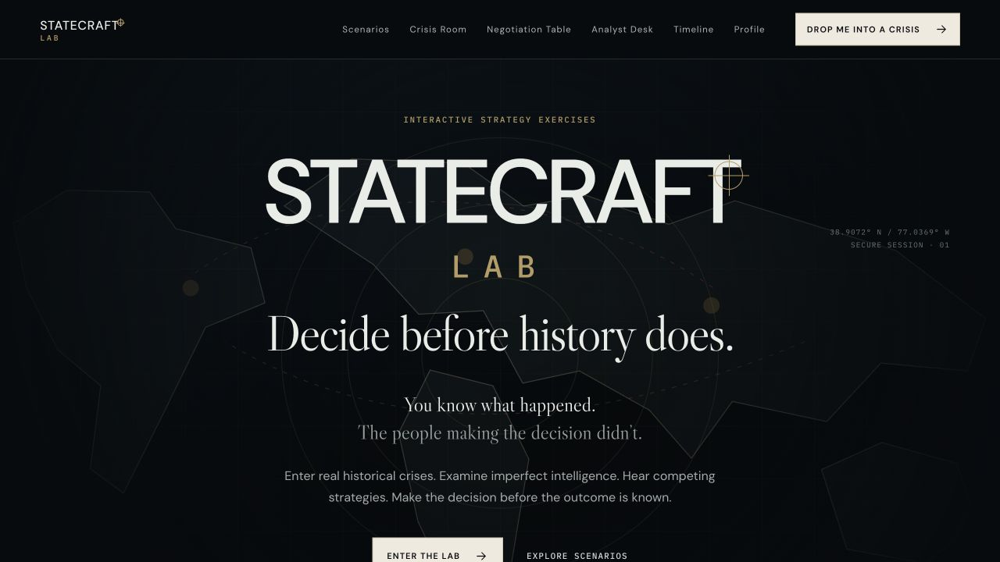
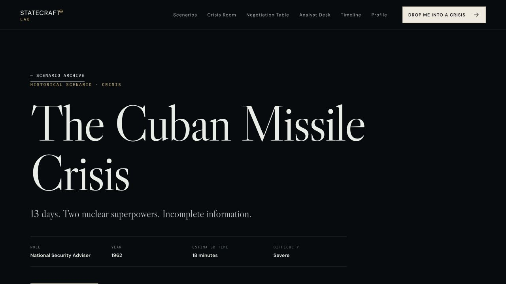
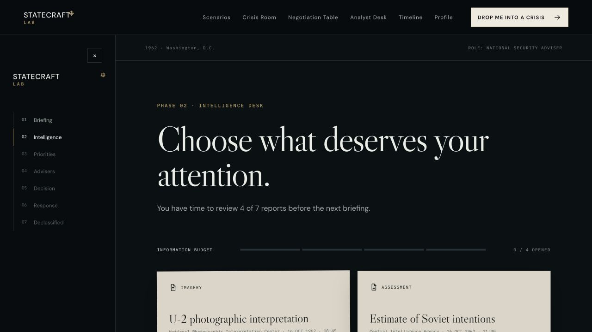

# Statecraft Lab

**Decide before history does.**

Statecraft Lab is an interactive geopolitical and historical decision-making simulator. It places the player inside political, diplomatic, military, economic, and intelligence crises where information is incomplete, advisers disagree, and every available option carries a cost.

[View the live experience](https://statecraft-lab.netlify.app/)

## Screenshots

### Command center



### Scenario dossier



### Intelligence desk



## The idea 

I studied International Relations at Jagiellonian University, where we worked through political strategy exercises and considered how decision-makers respond to complex situations under pressure. Those discussions inspired this project because strategic decision-making is a fascinating subject—and because it becomes much less obvious when hindsight is removed.

It can seem simple to judge another person's decisions after we already know what happened. But the people making those decisions did not know the outcome. They had only the information available at that moment: incomplete intelligence, competing interpretations, institutional pressure, limited time, and the possibility that every option could make the situation worse.

Statecraft Lab explores that gap. It asks users to make the decision first and encounter the historical outcome later. The central question is not whether a player can identify the “correct” answer, but what they would prioritize, what uncertainty they would accept, and whether the choice that now appears obvious would still feel obvious from inside the room.

## Product idea

> History looks obvious after it happens. Strategy does not.

This is not a history quiz or a trivia game. Each exercise is designed as a lightweight strategic simulation built around five principles:

1. Information is incomplete.
2. Every decision has a trade-off.
3. Consequences evolve after the first choice.
4. Different actors interpret the same evidence differently.
5. Hindsight is withheld until the exercise is complete.

## Core experience

- **Briefing:** Understand the role, objective, known facts, assumptions, and critical unknowns.
- **Intelligence desk:** Choose which sources deserve attention within a limited information budget.
- **Strategic priorities:** Decide which interests matter most before selecting a policy.
- **Adviser room:** Compare plausible but conflicting strategic recommendations.
- **Decision:** Commit to an option with a meaningful upside, risk, unknown, and strategic cost.
- **World response:** See how other actors react and make a second decision when the environment changes.
- **Declassified reveal:** Compare the player's reasoning with the historical outcome and later archival evidence.

The product never labels a strategy as correct, wrong, a victory, or a defeat. Instead, it describes the priorities and trade-offs reflected in the player's approach.

## Included experiences

The scenario archive includes fifteen historical exercises, led by a flagship Cuban Missile Crisis simulation, as well as fictional exercises that allow broader exploration without rewriting history.

Modes include:

- Crisis Room
- Negotiation Table
- Analyst Desk
- Political strategy exercises

Additional product surfaces include a historical timeline, scenario discovery filters, saved progress, a strategic profile, a product case study, and a local-only demo analytics dashboard.

## Historical integrity

Historical scenarios separate confirmed facts, contemporary assumptions, unresolved unknowns, and later archival evidence. Reconstructed documents are clearly labelled as historical reconstructions, direct quotations are not invented, and reference sources are included in each completed historical dossier.

## Technology

- React
- TypeScript
- Vite
- CSS
- LocalStorage for progress, preferences, and local analytics
- Netlify for the live deployment

No backend is required for the current product concept.

## Run locally

```bash
pnpm install
pnpm dev
```

Create a production build:

```bash
pnpm run build
```

Run the linter:

```bash
pnpm run lint
```

## Current scope

The Cuban Missile Crisis is the deepest scenario and includes a second reactive decision moment. The remaining historical scenarios use the shared simulation framework with one principal decision and an evolving response. Deeper negotiation rounds, richer operational maps, and counterfactual replay branches are natural areas for future development.
